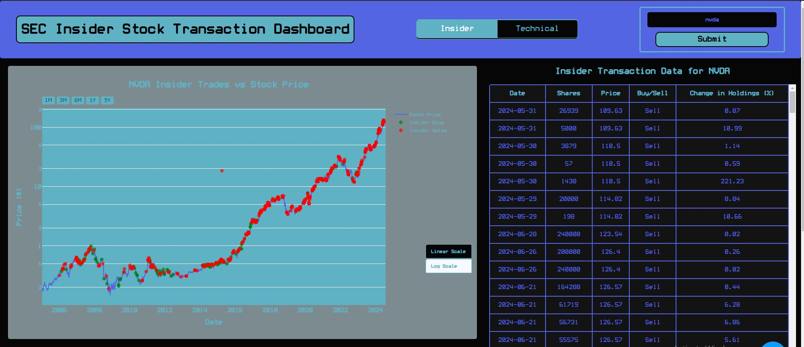
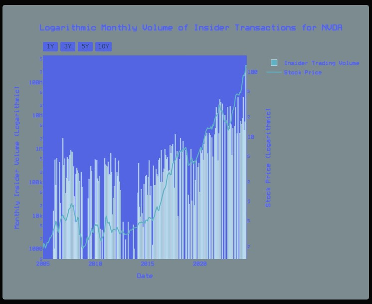
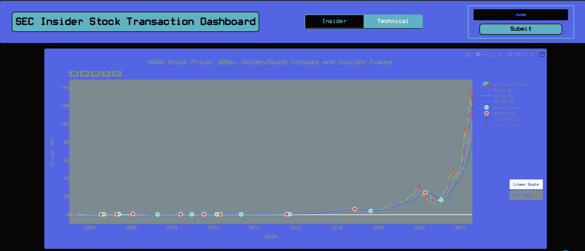
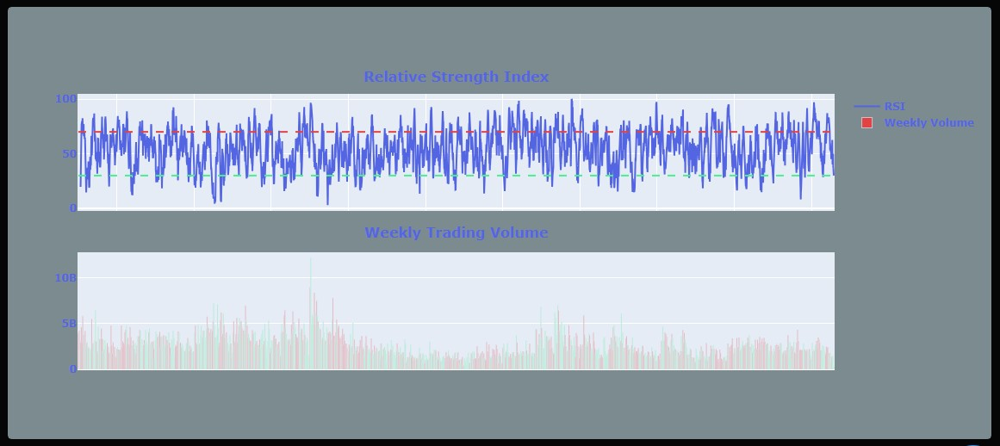
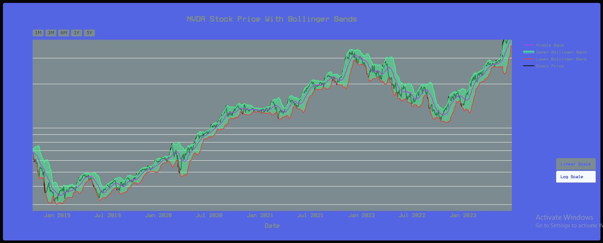

# Insider Stock Transaction Dashboard

This is a dashboard to visualize stock prices and technical indicators in insider trades. This application is made using Python specifically the dash library, plotly, and some css. I have always loved trading stocks and cryptocurrencies and have found insider transaction data extremely useful when trading. The website I used to use to find insider stock data is pretty ugly to me. I found myself going back and forth between this ugly website and trading view drawing vertical lines where insider transactions took place and overall just having a tough time. After finishing the CS50ai course, I wanted to make a big project using Python. I did not want to make a common run-of-the-mill thing that everyone else has done, and most importantly I wanted to provide real use. This was ultimately what I decided to do. I had to learn a lot about data science, working with databases, DataFrames, huge TSV files, and processing large amounts of data with maximum efficiency. After completing the first fully working base release, not only have I learned a TON but I truly believe this is a very useful tool for anyone that trades stocks. Essentially any stock can be inputted into this application and all insider transactions along with basic stock data will be visualized cleanly and helpfully.

## Steps to use:

1. git clone git@github.com:koleada/Insider-Stock-Transaction-Dashboard.git
2. Download the database to your local machine from the 'Releases' section of the repository
3. pip install -r requirements.txt
4. **DO NOT FORGET TO CHANGE THE FILE PATH TO THE DATABASE in app.py line 158**
5. Run app.py, open the local file in your browser, input any stock, and begin your analysis!

## Pictures and Explanations:

The application contains two main pages, Insider and Technical.

**Insider Page:**
The insider page contains a main graph showcasing stock prices with all insider transactions overlaid. Upon hovering over the insider transactions you can see a bunch of info like the number of shares, average cost, and date filed. Each of the transactions is either green or red, showing if that transaction was a buy or sell respectively. This main chart can be either log or linear. Below this main chart, there is a chart depicting the monthly insider trading volume for the specific stock along with the overlaid stock price. Finally, on the right side, there is a table containing all insider transactions. The table is ordered by date it shows the shares, average price, buy/sell, and the percent change in holdings after the transaction.

**Technical Page:**
The technical page focuses less on insider trades and more on some of the most common and useful technical indicators. The main graph on this page is a candlestick chart of the stock's daily closing price. It then contains 3 commons SMAs 50-day, 100-day, and 200-day. I also highlighted golden and death crosses which, for those unfamiliar, are very effective indicators. A golden cross occurs when the 50-day SMA rises above the 200-day SMA and the reverse indicates a death cross. These indicators are very good at identifying long-term momentum shifts. I did include the insider data on this graph as well but it is not visible at first, it can easily be made visible by clicking on the legend.

This page also contains a graph showing the relative strength index over the same time frame as the main graph. If unfamiliar with RSI, the two dashed lines show two important levels of strength, the red is 70 and the green is 30. RSI above 70 usually means we are approaching oversold territory. RSI below 30 often aligns closely with local bottoms. Also shown on this graph is the total weekly trading volume again along the same time frame as the main graph.

Lastly, this page contains a line graph showing the stock price with Bollinger bands overlaid. The middle band is simply the 20-day SMA and the upper and lower bands are created using a simple calculation using the 20-day SMA along with the 20-day standard deviation. Bollinger bands can be very useful in identifying changes in the momentum of a stock's price.

### Notes:

The insider trading data comes right from the SEC and is stored in the database. Due to the large size of the database, it must be downloaded from the releases section of the repository. For now, I will continue to update the database locally and thus provide a new release. Specifically, I will update the database quarterly for the time being. The database must be downloaded to your local machine for this dashboard to work.

I included a lot of 'extra' code that I used for testing, creating the database, and generally experimenting before creating the actual application. There was a lot of behind-the-scenes code used to process and clean the quite messy SEC data. I created this project as something that provides use to me but also to share on my resume so I wanted to fully show my entire learning/thought process throughout the creation of this project.

### Technical Details and Thought Process:

**Gathering Data:**

After I decided this was the project I wanted to do, I began by looking into how to get the insider transaction data. There are a lot of great SEC APIs, but they ALL cost money and even still are far from ideal for extracting large amounts of data. After looking at these APIs, I pivoted and began looking at the data offered directly by the SEC. I checked out the EDGAR database in thoughts of querying the database and scraping the response with Python. The database was rather unintuitive and I decided to keep looking. The SEC has its API which is even more unintuitive than the database and has very little documentation. I messed around with it for a while until I stumbled upon a large list of insider trading data separated by quarter that are available for download. The data begins in 2006 and contains essentially all of the information I'm looking for. These files are pretty inconsistent with what values are present, contain malformed data, and are otherwise messy. Still, I knew these would be perfect for this project.

**Setting Up the Database:**

Once I downloaded the raw data, it was time to process all of the non-derivative trading data. There were a total of 73 directories of data, each with two files called submission and non-derivative trading data. Each file contains, on the low end, 50,000 lines of data. The data uses a unique ID called an accession number for each transaction or transaction if multiple were filed together. The submission data contains important information like the company ticker symbol and non-derivative transaction data contains information like number of shares, acquired or disposed (buy or sell), price per share, and shares owned following the transaction.

Because of the huge amount of data I'm dealing with I needed to read in, manipulate, and export the data as efficiently as possible. To do this I opted to use the amazing polars library, which is similar to pandas but made with rust and offers significant performance improvements in many areas. To ensure my code was correct, I made two small test files using the data and made small notebooks to test my code before making the full script. The main code I used for this data processing is called getTransData.py. There was a lot of trial and error and time put into making this script. I tried a few different ways of doing things before converging on this method. I used polars to scan the TSV files resulting in two DataFrames one for submission and one for transaction data. I then had to process each of them, for the submission df I had to find any non-letter characters and replace them with an empty string, look for malformed tickers such as ones that have a length greater than 5, and also find tickers that are SQL keywords (unfortunately these could not be included). I also had to turn all filing dates into a standard format to be used as DateTime objects later in the project. Alternatively, for the transaction data I had to find duplicate accession numbers and handle those before submitting to the database. I decided it would be best to just combine the transactions that have the same accession number. These transactions often have the same date plus or minus a day or two and usually all represent buys or all represent sales. I then summed the shares and shares owned after the transaction and took the mean of the price per share. Once the data manipulation was complete I combined the two DataFrames on accession numbers and threw each transaction into my SQLite database. I'm pretty proud of the code I made for this, I think I leveraged the right tooling and came up with an efficient way to accomplish this task.

As I mentioned, I did a ton of experimentation before coming up with this approach. I think the first thing I tried was to parse the submission data first and add them all to the database then go back to process the transaction files and add them to the correct spots in the database. I wanted to create a separate database table for each stock ticker so what I did was write to a JSON file. The JSON file contained an object for each stock ticker that contained an array of transaction data. This took FOREVER to do and that was before I wrote the data to the database. I ran into problems with the malformed data because I didn't know it was malformed. At this point, I hadn't considered dealing with duplicate transaction data either so when I considered that I just decided to find a different method.

**Creating The Dashboard:**

Once the data was processed and stored in the database, I moved on to brainstorming the most useful way to visualize all of this data. All of the major different graphs on the dashboard were first outlined in a notebook and then put into the dashboard. I wanted to make a simplified version first and make sure that was correct before adding it to the dashboard. I also was new to plotly so I needed to play around a get a feel for it. Once I had some ideas and outlines I began learning about dash and creating the dashboard. I'm already quite familiar with HTML and CSS so creating the dashboard itself was the easiest part. I had to learn about callbacks which were new and learn exactly how dash and dash bootstrap components worked syntactically. After that it was just a matter of styling, creating the color scheme, and overall making it look good.

**Future:**

I wanted to just get a base release of this project out as soon as possible. Shortly, I will go back through mainly to catch and handle potential exceptions. I have used a website to notify me when the SEC releases more quarterly datasets. Once any new ones are available I will simply use the getTransData.py script to process the data and add it to the database. Another big issue I want to fix lies in the database. Requiring users to download the entire database is not optimal by any means. I will continue to look for free hosting solutions and potentially migrate the SQLite database to another relational database. Thus I could change the program to connect to the remote database that provides read-only access. Again, I just wanted to release something that works as quickly as possible. I am also considering creating an API that could handle interfacing with the database, but this will be far down the line. 
